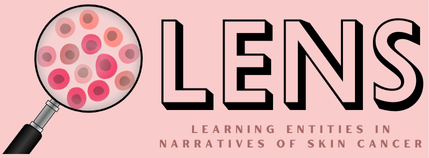

# Learning Entities from Narratives of Skin Cancer (LENS)
  

## Overview

**Learning Entities from Narratives of Skin Cancer (LENS)** is a Python library designed for Named Entity Recognition (NER) specifically tailored to narratives related to skin cancer. LENS is designed to recognize and categorize important entities within skin cancer narratives. It is equipped with 24 distinct tags (see file **[annotation_guidelines.pdf](https://docs.google.com/document/d/1HO2WHfxTdNh2rTGXeQ9732eu2Xc5kre5_o68yY9NLqg/edit?usp=sharing)**), which allow for the extraction of key information from unstructured text. This information can be linked to biomedical ontologies such as **[SNOMED-CT](https://colab.research.google.com/github/CogStack/MedCATtutorials/blob/main/notebooks/specialised/Preprocessing_SNOMED_CT.ipynb#scrollTo=o-TxIJ4N9T4Q)** and **[MedCAT](https://github.com/CogStack/MedCAT?tab=readme-ov-file)**, facilitating structured data analysis in clinical and research settings.


## Objective

The primary objective of LENS is to process input text—such as online narratives from platforms like Reddit—and return the corresponding **LENS tags**. These tags allow for the categorization of various entities mentioned in the text, facilitating further analysis and integration with biomedical ontologies.


## Installation

To install the latest version of LENS, please run the following command:

```bash
pip install https://huggingface.co/dml2611/LENS/resolve/main/small_sample_ner_lens_c1-0.1.0-py3-none-any.whl
```


## Usage Example

Below is an example of how to use LENS to extract entities from a skin cancer narrative:

```python
import onco_lens_ner as lens

text = "I was diagnosed with melanoma last year. I'm currently undergoing immunotherapy and sometimes feel nauseous."
entities = lens.get_entities(text)
print(entities)
```


## Functionalities

LENS provides a range of functionalities to meet diverse user needs:

1. **Extract all LENS entities:** Identify and extract all recognized entities from a given text.
```python
entities = lens.get_entities(text)
print(entities)
```

2. **Display all entities:** Output the extracted entities with their corresponding tags.
```python
lens.display_entities(text)
```

3. **Extract entities for a specific label:** Extract entities corresponding to a specific tag, such as `INV` (Investigation).
```python
entities = lens.get_entities(text, tag_list=['INV'])
print(entities)
```

4. **Extract entities for a subset of labels:** Focus on a subset of tags, for example, `TRT` and `SYM`.
```python
entities = lens.get_entities(text, tag_list=['TRT', 'INV'])
print(entities)
```

5. **Display entities for a subset of labels:** Output entities for specific tags, such as `TRT`, `SYM`, and `INV`.
```python
lens.display_entities(text, tag_list=['TRT', 'SYM','INV'])
```

6. **Extract all MedCAT Mappings:** Link recognized entities to MedCAT biomedical concepts.
```python
lens.display_entities(text)
```

7. **Extract all SNOMED-CT Mappings:** Link recognized entities to SNOMED-CT concepts.
```python
lens2medcat = lens.lens2medcat(text)
print(lens2medcat)
```

8. **Save the annotations in JSON format:** Save the extracted entities and mappings in a structured JSON file for further analysis.
```python
lens2snomedct = lens.lens2snomedct(text)
print(lens2snomedct)
```


## Tutorial

A comprehensive tutorial on how to use LENS, including advanced features, is available [here](https://colab.research.google.com/drive/1y-X4AtWmxp4IsTg4t9jbrY70B7GQfEBh?usp=sharing).


## License

LENS is licensed under the MIT License. Please see the [LICENSE](LICENSE.txt) file for further information.


## 📚 Citation

If you use this repository or reference the LENS extraction method, please cite:

```bibtex
@inproceedings{lal-etal-2025-lens,
    title = "{LENS}: Learning Entities from Narratives of Skin Cancer",
    author = "Lal, Daisy Monika  and
      Rayson, Paul  and
      Peter, Christopher  and
      Ezeani, Ignatius  and
      El-Haj, Mo  and
      Zhu, Yafei  and
      Liu, Yufeng",
    editor = "Rambow, Owen  and
      Wanner, Leo  and
      Apidianaki, Marianna  and
      Al-Khalifa, Hend  and
      Eugenio, Barbara Di  and
      Schockaert, Steven  and
      Mather, Brodie  and
      Dras, Mark",
    booktitle = "Proceedings of the 31st International Conference on Computational Linguistics: System Demonstrations",
    month = jan,
    year = "2025",
    address = "Abu Dhabi, UAE",
    publisher = "Association for Computational Linguistics",
    url = "https://aclanthology.org/2025.coling-demos.3/",
    pages = "20--27",
    abstract = "Learning entities from narratives of skin cancer (LENS) is an automatic entity recognition system built on colloquial writings from skin cancer-related Reddit forums. LENS encapsulates a comprehensive set of 24 labels that address clinical, demographic, and psychosocial aspects of skin cancer. Furthermore, we release LENS as a PyPI and pip package, making it easy for developers to download and install, and also provide a web application that allows users to get model predictions interactively, useful for researchers and individuals with minimal programming experience. Additionally, we publish the annotation guidelines designed specifically for spontaneous skin cancer narratives, that can be implemented to better understand and address challenges when developing corpora or systems for similar diseases. The model achieves an overall entity-level F1 score of 0.561, with notable performance for entities such as ``CANC{\_}T'' (0.747), ``STG'' (0.788), ``POB'' (0.714), ``GENDER'' (0.750), ``A/G'' (0.714), and ``PPL'' (0.703). Other entities with significant results include ``TRT'' (0.625), ``MED'' (0.606), ``AGE'' (0.646), ``EMO'' (0.619), and ``MHD'' (0.5). We believe that LENS can serve as an essential tool supporting the analysis of patient discussions leading to improvements in the design and development of modern smart healthcare technologies."
}
